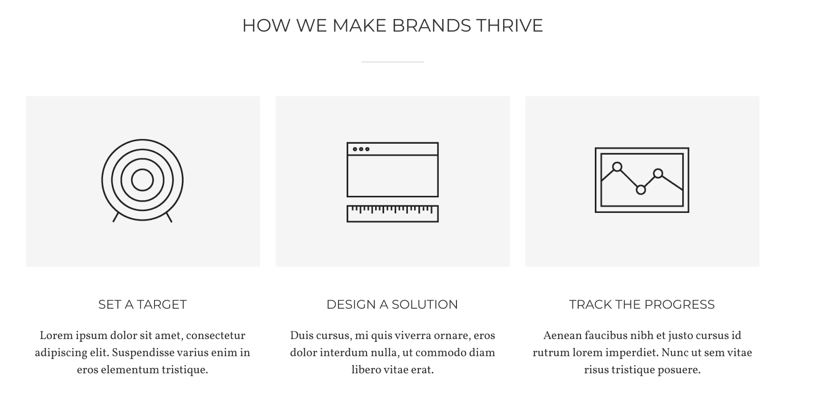
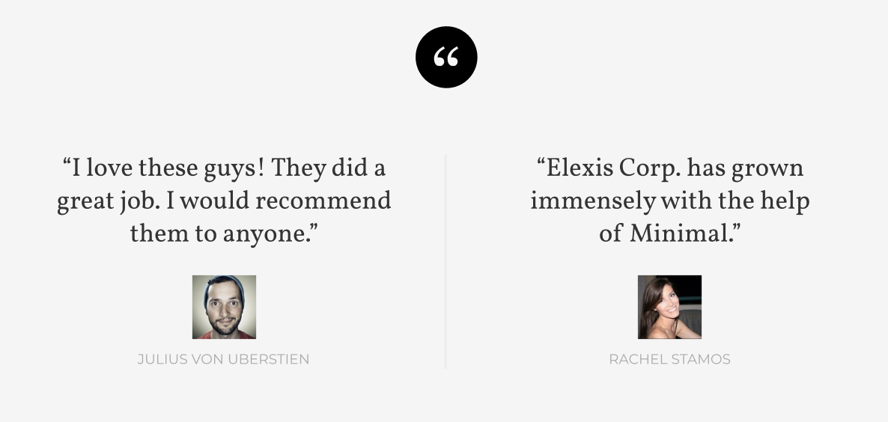
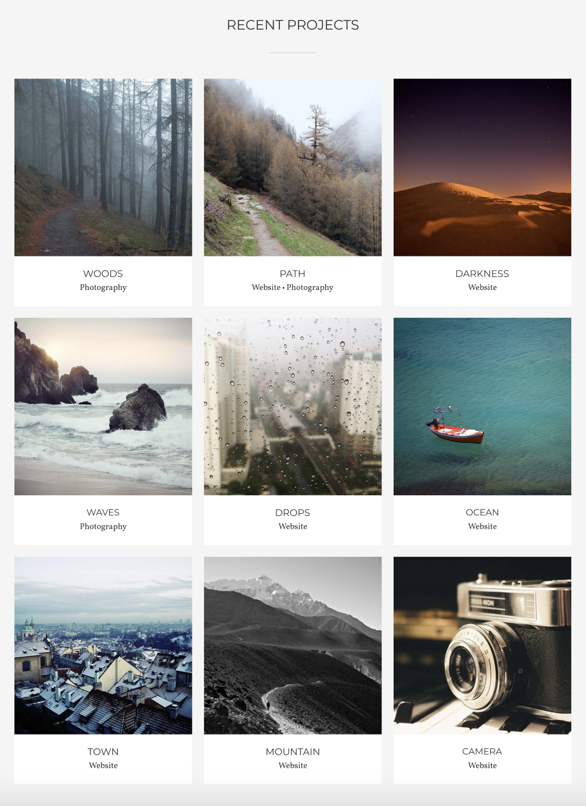

# BEM
head  
head__eye_green  
head__eye_blue  
head__mouth_closed  

arms  
arms__shoulder_left  
arms__shoulder_right  
arms__wrist_strong  

body  
body__back_wide  
body__chest_pumped  
body__abs_strong  

legs  
legs__knee_left  
legs__knee_right 
legs__feet_size_9 

# Emmet
## Header
 
header.header>div.header__wrapper>(div.header__logobox>img.header__logo+p.header__naming)+nav.header__nav>ul.header__list>(li.header__item>a.header__link)*5

## Card
 
main>section.cards>div.cards__wrapper>h2.cards__title+(div.card>img.card__image+h3.card__title+p.card__text)*3

## Reviews
 
main>section.reviews>div.reviews__wrapper>img.reviews__img+(div.review>p.review__text+img.review__img+p.review__name)*2

## Projects
 
section.projects>div.projects__wrapper>h2.projects__title+(div.project>img.project__img+h3.project__name+p.project__category)*9